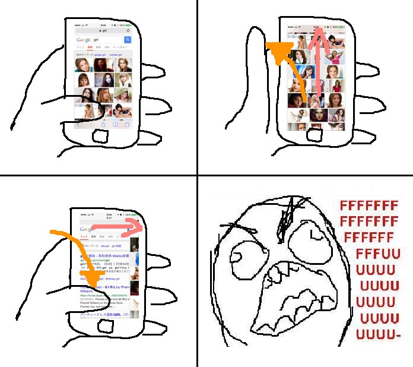
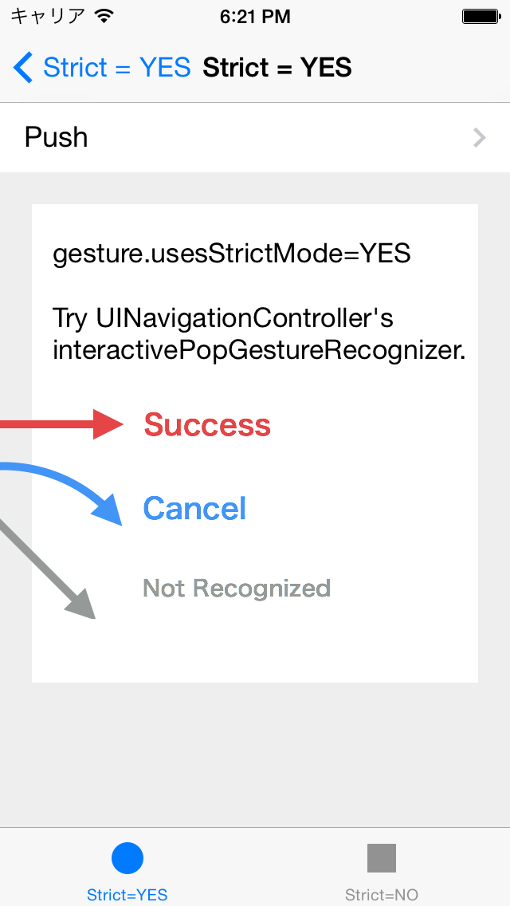

YIStrictEdgePanGesture
======================

Never get angry with UINavigationController's interactivePopGestureRecognizer.

How to use
------------

If you want to disable it, simply set `gesture.usesStrictMode = NO`.

Dependencies
------------
- [JRSwizzle 1.0](https://github.com/rentzsch/jrswizzle)

License
-------
`YIStrictEdgePanGesture` is available under the [Beerware](http://en.wikipedia.org/wiki/Beerware) license.

If we meet some day, and you think this stuff is worth it, you can buy me a beer in return.
